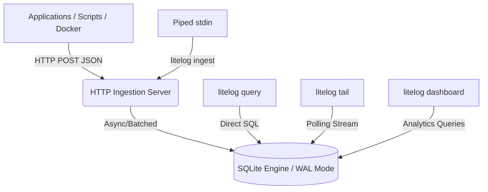

<div align="center">
  
  <p><b>Centralized logging without the infrastructure. The SQLite of logging systems.</b></p>

  [](https://github.com/yashnaiduu/Litelog)
  [](https://github.com/yashnaiduu/Litelog/blob/main/LICENSE)
  [](https://github.com/yashnaiduu/Litelog/pulls)

  <p>
    <a href="#why-litelog">Why?</a> •
    <a href="#features">Features</a> •
    <a href="#quick-start">Quick Start</a> •
    <a href="#commands">Commands</a> •
    <a href="#architecture">Architecture</a> •
    <a href="docs/GUIDE.md">Full Guide</a>
  </p>
</div>

---

## Why LiteLog?

Modern logging stacks like Elasticsearch + Logstash + Kibana or Prometheus/Grafana are powerful but overkill for side projects, small production systems, CI/CD pipelines, and indie deployments.

These stacks require multiple services, gigabytes of RAM, and tedious configuration. Developers often fall back to:

```bash
tail -f logfile | grep error
```

LiteLog replaces this entirely. It is a single Go binary that acts as an HTTP log ingestion server, a high-performance SQLite storage engine, and a CLI query interface with real-time streaming and a live terminal dashboard.

## Features

- **Zero Configuration:** No config files. No sidecars. Run one binary and you have a full logging stack.
- **High Performance:** Async goroutines + SQLite WAL mode engineered for thousands of logs per second.
- **SQL Query Engine:** Query structured logs with standard SQL directly from the terminal.
- **Live Terminal Dashboard:** Monitor logs, services, and error rates via an `htop`-style TUI powered by BubbleTea.
- **Micro-Footprint:** Under 40MB of RAM. Competes with stacks requiring 2GB+.

## Quick Start

**Install with Go:**
```bash
go install github.com/yashnaiduu/Litelog/cmd/litelog@latest
```

**Or clone and build from source:**
```bash
git clone https://github.com/yashnaiduu/Litelog.git
cd Litelog
go build -o litelog cmd/litelog/main.go
```

**Start the server:**
```bash
./litelog start --retention 7d
```

Server listens on `localhost:8080` and creates `litelog.db` automatically.

## Commands

### `litelog ingest`
Pipe any program's output directly into LiteLog.

```bash
python my_app.py 2>&1 | litelog ingest
```

### `litelog tail`
Stream logs live in the terminal with optional filters.

```bash
litelog tail --level ERROR --service auth-service
```

### `litelog query`
Run standard SQL against your log database.

```bash
litelog query "SELECT timestamp, message FROM logs WHERE level='ERROR' LIMIT 10"
litelog query "SELECT service, COUNT(*) FROM logs GROUP BY service"
```

### `litelog dashboard`
Open a full-screen live terminal dashboard.

```bash
litelog dashboard
```

### `litelog export`
Export logs to JSON or CSV.

```bash
litelog export --service auth-service --format json > auth-logs.json
```

## Benchmarks

| Tool | RAM Usage |
|---|---|
| ELK Stack | 2GB+ |
| **LiteLog** | **~40MB** |

| Tool | Startup Time |
|---|---|
| Elasticsearch | ~30s |
| **LiteLog** | **< 1s** |

## Architecture



## API Reference

**POST /ingest**

```bash
curl -X POST http://localhost:8080/ingest \
  -H "Content-Type: application/json" \
  -d '{
    "level": "error",
    "service": "payment-api",
    "message": "database connection refused"
  }'
```

Returns `200 OK` on a valid payload.

## Roadmap

- **Phase 1** (Current): Ingestion server, SQLite storage, SQL CLI, streaming, terminal dashboard
- **Phase 2**: Regex filters in tail, custom TUI charts, `json_extract` support in queries
- **Phase 3**: Docker logging driver, distributed instances via Raft

## Contributing

1. Fork the repository
2. Create a feature branch (`git checkout -b feature/my-feature`)
3. Commit your changes
4. Push to the branch
5. Open a Pull Request

## License

Distributed under the MIT License. See [LICENSE](LICENSE) for more information.

---

> LiteLog — centralized logging without the infrastructure.
