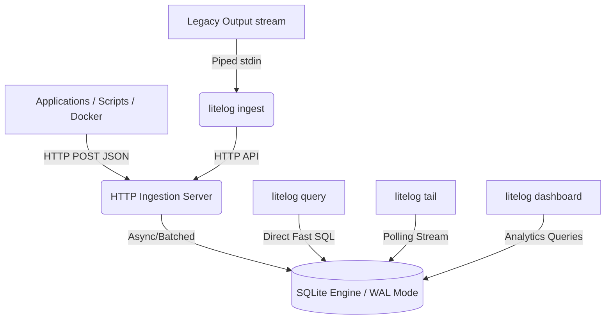

<div align="center">
  
  <p><b>Centralized logging without the infrastructure. The SQLite of logging systems.</b></p>

  [](https://github.com/yashnaiduu/Litelog)
  [](https://github.com/yashnaiduu/Litelog/blob/main/LICENSE)
  [](https://github.com/yashnaiduu/Litelog/pulls)

  <p>
    <a href="#-why-litelog">Why?</a> •
    <a href="#-features">Features</a> •
    <a href="#-quick-start">Quick Start</a> •
    <a href="#-the-5-core-commands">Commands</a> •
    <a href="#-architecture">Architecture</a>
  </p>
</div>

---

## 🚀 Why LiteLog?

Modern logging stacks like Elasticsearch + Logstash + Kibana (ELK) or Prometheus/Grafana are incredibly powerful—but they are absolute overkill for side projects, small production systems, CI/CD pipelines, and indie hacker deployments.

These heavy stacks mandate multiple services, gigabytes of RAM, and tedious configuration files. Instead, developers often regress to running:

```bash
tail -f logfile | grep error
```

**This stops now.** 

**LiteLog** bridges the gap. It is a hyper-fast, zero-dependency, single Go binary that operates as an HTTP log ingestion server, a high-performance local SQLite storage engine, and a CLI-based SQL query interface with real-time streaming dashboards.

## ✨ Features

- **Zero Configuration Setup:** No `.yml` files. No sidecars. Run one binary and you have an ingest server and query CLI.
- **High Performance:** Go + `go-sqlite3` combined with SQLite WAL mode and Memory pragmas engineered for massive write throughput.
- **Powerful SQL Query Engine:** Type standard SQL in your terminal to filter queries across thousands of structured logs instantly.
- **Live Terminal Dashboard:** Forget opening browsers—monitor logs, services, and error rates via a `htop`-style console application powered by BubbleTea.
- **Micro-Footprint:** Takes less than 40MB of RAM. Competes with stacks needing 2GB+.

## ⚡ Quick Start

### 1. Install

**Via standard Go Install:**
```bash
go install github.com/yashnaidu/litelog@latest
```

**Or clone and build from source:**
```bash
git clone https://github.com/yashnaidu/litelog.git
cd litelog
go build -o litelog .
```

### 2. Run the server

```bash
./litelog start --retention 7d
```
> Server is immediately listening on `localhost:8080`, logging straight into `litelog.db` (automatically created). Retention deletes old data automatically!

## 🛠 The 5 Core Commands

LiteLog packs a full developer platform within a single binary.

### 1. 📥 `litelog ingest`
One-line Docker or Script integration. Pipe standard output directly into LiteLog's ingestion engine.

```bash
python my_app.py 2>&1 | litelog ingest
```
*It automatically parses simple unstructured log levels or routes JSON!*

### 2. 🌊 `litelog tail`
Instead of running SQL queries, developers can watch logs stream live in the terminal.

```bash
litelog tail --level ERROR --service auth-service
```
*Logs stream instantly as apps pump them into the server.*

### 3. 🔍 `litelog query`
Raw, unbound SQLite capabilities on your logs without leaving the console. Lookbacks, aggregations, max latency searches. 

```bash
litelog query "SELECT timestamp, message FROM logs WHERE level='ERROR' LIMIT 10"
litelog query "SELECT service, COUNT(*) FROM logs GROUP BY service"
```

### 4. 📊 `litelog dashboard` (Hackathon Gold)
An insanely polished, live terminal TUI akin to `htop` for your application infrastructure. 

```bash
litelog dashboard
```
Shows Live Logs/sec, Total Logs, Error Spikes, and Top Noisy Services all updated in real-time.

### 5. 📦 `litelog export`
Dump logs back out into JSON or CSV. Perfect for handing off to data science or passing to `jq`.

```bash
litelog export --service auth-service --format json > auth-logs.json
```

## ⚡ Benchmarks

LiteLog competes beautifully on efficiency by stripping networking logic and leveraging memory-mapped file access.

### Resource Usage

| Tool          | RAM Usage | Component Footprint         |
|---------------|-----------|-----------------------------|
| **ELK Stack** | `2GB+`    | Elasticsearch, JVM, Kibana  |
| **LiteLog**   | `~40MB`   | Single Go binary            |

### Startup Time

| Tool              | Time       |
|-------------------|------------|
| **Elasticsearch** | `~30s`     |
| **LiteLog**       | `<1s`      |

## 🏗 Architecture

LiteLog ensures zero network boundaries between ingestion, storage, and presentation:



## 🔌 API Reference

If you aren't using `litelog ingest`, simply POST to the server natively.

**POST /ingest**

```bash
curl -X POST http://localhost:8080/ingest \
  -H "Content-Type: application/json" \
  -d '{
    "timestamp": "2026-03-05T10:00:00Z",
    "level": "error",
    "service": "payment-api",
    "message": "database connection refused"
  }'
```

Returns `200 OK` on valid payload.

## 🛤 Open Source Roadmap
- **Phase 1** (✅ Current): Ingestion Server, SQLite Storage, SQL CLI, Streaming & Dashboards
- **Phase 2**: Real-time Regex Filters in Tail, Custom TUI charts, and JSON un-marshalling inside queries using `json_extract`.
- **Phase 3**: Docker Logging Driver (`--log-driver=litelog`), Distributed LiteLog instances clustering via Raft.

## 🤝 Contributing

Contributions are what makes the open-source community such an amazing place to learn, inspire, and create. Any contributions you make are **greatly appreciated**.

1. Fork the Project
2. Create your Feature Branch (`git checkout -b feature/AmazingFeature`)
3. Commit your Changes (`git commit -m 'Add some AmazingFeature'`)
4. Push to the Branch (`git push origin feature/AmazingFeature`)
5. Open a Pull Request

## ⚖️ License
Distributed under the MIT License. See `LICENSE` for more information.

> LiteLog — centralized logging without the infrastructure.
