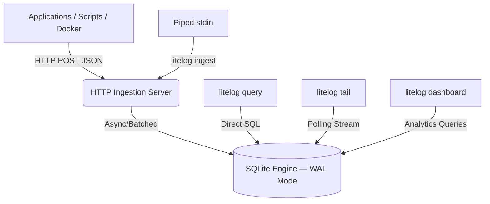

<div align="center">
  
  <h1>LiteLog</h1>
  <p><b>Centralized logging without the infrastructure. The SQLite of logging systems.</b></p>

  [](https://go.dev/)
  [](LICENSE)
  [](https://github.com/yashnaiduu/Litelog/actions)
  [](CONTRIBUTING.md)
  [](https://goreportcard.com/report/github.com/yashnaiduu/Litelog)

  <p>
    <a href="#why-litelog">Why?</a> •
    <a href="#features">Features</a> •
    <a href="#installation">Installation</a> •
    <a href="#commands">Commands</a> •
    <a href="#architecture">Architecture</a> •
    <a href="#contributing">Contributing</a>
  </p>
</div>

---

## Why LiteLog?

Modern logging stacks like ELK or Prometheus + Grafana are powerful — but overkill for most projects. They require multiple services, gigabytes of RAM, and tedious configuration. Developers fall back to:

```bash
tail -f logfile | grep error
```

**LiteLog replaces this entirely.** It is a single Go binary that acts as an HTTP log ingestion server, a high-performance SQLite storage engine, and a CLI query interface with real-time streaming and a live terminal dashboard.

---

## Features

- **Zero Configuration** — No YAML files. No containers. Run one binary and your entire logging stack is live in under a second.
- **SQL Query Engine** — Query structured logs with standard SQL directly from the terminal. Filter, group, and aggregate with full SQLite support.
- **Real-Time Streaming** — Stream live logs with `litelog tail`. Filter by service or severity level as events arrive.
- **Terminal Dashboard** — A live, full-screen `htop`-style TUI dashboard powered by BubbleTea showing ingestion rates, error counts, and active services.
- **Async Ingestion Pipeline** — The HTTP handler returns immediately. Logs are batched and flushed asynchronously via background goroutines.
- **Micro-Footprint** — Under 40MB of RAM. Competes with stacks requiring 2GB+.

---

## Installation

**Install with `go install`:**
```bash
go install github.com/yashnaiduu/Litelog/cmd/litelog@latest
```

**Clone and build from source:**
```bash
git clone https://github.com/yashnaiduu/Litelog.git
cd Litelog
go build -o litelog ./cmd/litelog
```

**Download a prebuilt binary:**

See the [Releases](https://github.com/yashnaiduu/Litelog/releases) page for prebuilt binaries for Linux, macOS, and Windows (via GoReleaser).

---

## Quick Start

```bash
# Start the log server (7-day retention)
./litelog start --retention 7d

# Pipe your app's output directly in
python my_app.py 2>&1 | litelog ingest

# Stream live logs
litelog tail --level ERROR --service auth-service

# Query with SQL
litelog query "SELECT service, COUNT(*) FROM logs GROUP BY service"
```

The server listens on `localhost:8080` and creates `litelog.db` automatically.

---

## Commands

| Command | Description |
|---|---|
| `litelog start` | Start the HTTP ingestion server |
| `litelog ingest` | Pipe stdin into LiteLog |
| `litelog tail` | Stream live logs with optional filters |
| `litelog query "<sql>"` | Run SQL against the log database |
| `litelog dashboard` | Open the full-screen TUI dashboard |
| `litelog export` | Export logs to JSON or CSV |

### `litelog tail`
```bash
litelog tail --level ERROR --service auth-service
```

### `litelog query`
```bash
litelog query "SELECT timestamp, message FROM logs WHERE level='ERROR' LIMIT 10"
litelog query "SELECT service, COUNT(*) FROM logs GROUP BY service ORDER BY COUNT(*) DESC"
```

### `litelog export`
```bash
litelog export --service auth-service --format json > auth-logs.json
litelog export --format csv > all-logs.csv
```

---

## HTTP API

**POST /ingest**
```bash
curl -X POST http://localhost:8080/ingest \
  -H "Content-Type: application/json" \
  -d '{
    "level": "error",
    "service": "payment-api",
    "message": "database connection refused"
  }'
```

Returns `200 OK` on a valid payload.

---

## Benchmarks

| Tool | RAM Usage | Startup Time |
|---|---|---|
| ELK Stack | 2 GB+ | ~30s |
| Prometheus + Grafana | 500 MB+ | ~15s |
| **LiteLog** | **~40 MB** | **< 1s** |

---

## Architecture



---

## Roadmap

See [ROADMAP.md](ROADMAP.md) for the full planned feature set.

- **Phase 1** ✅ — Ingestion server, SQLite storage, SQL CLI, streaming, terminal dashboard
- **Phase 2** — Regex filters, `json_extract`, named queries, TUI charts
- **Phase 3** — Docker logging driver, OpenTelemetry ingest, SD-notify
- **Phase 4** — Distributed mode via Raft, read replicas, remote WAL sync

---

## Contributing

LiteLog is fully open source under the Apache 2.0 license. Contributions are welcome.

- Report bugs or request features via [GitHub Issues](https://github.com/yashnaiduu/Litelog/issues)
- Read the [Contributing Guide](CONTRIBUTING.md) for setup, standards, and PR process
- Review the [Code of Conduct](CODE_OF_CONDUCT.md)
- Check the [Security Policy](SECURITY.md) for reporting vulnerabilities

---

## License

Distributed under the **Apache License 2.0**. See [LICENSE](LICENSE) for details.

---

<div align="center">
  <sub>LiteLog — centralized logging without the infrastructure.</sub>
</div>
